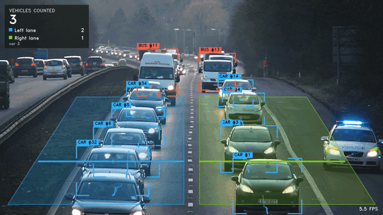
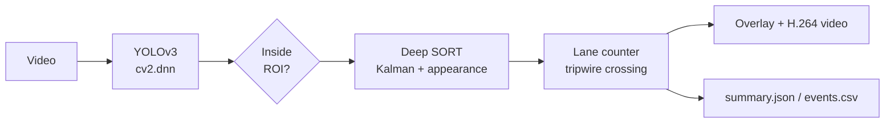

# Vehicle Detection, Tracking and Lane Counting

YOLOv3 detects vehicles, Deep SORT tracks them across frames, and a tripwire counter reports how many
vehicles passed in **each lane**, broken down by class.



> Real-world uses: cross-checking toll-booth collections, and monitoring lane rules (for example, whether
> heavy vehicles stay in their lane). Full-resolution output: run the [quick start](#quick-start) below.

Background reading from the original project:
[tracking and counting write-up](https://atharvamusale.medium.com/vehicle-tracking-and-counting-using-yolov3-and-deep-sort-f43d1c66c7c6) ·
[a comprehensive guide to YOLOv3](https://atharvamusale.medium.com/a-comprehensive-guide-to-yolov3-74029810ca81) ·
[original outputs](https://drive.google.com/drive/folders/10anYUOJ5sHdCH2lvFsgiGCs2JRs2j8dG)

## How it works



| Stage | Module | Notes |
| --- | --- | --- |
| Detect | `detector.py` | Original Darknet YOLOv3 weights via OpenCV DNN; filtered to car, bus, truck, motorbike |
| Track | `tracker.py`, `encoder.py` | Deep SORT with an HSV-histogram appearance feature; class label is a majority vote over the track |
| Count | `counter.py`, `lanes.py` | A vehicle is counted **once**, when its bottom-centre crosses its lane's tripwire |
| Render | `visualize.py` | Lane overlay, class-coloured boxes, trails, live HUD, tripwire flash on count |

### A fix worth calling out

The original notebook incremented a counter for every detection in every frame, so one car visible for
100 frames was counted as 100 cars. The counter now keys on track IDs and tripwire crossings; this
behaviour is covered by unit tests (`tests/test_counter.py`).

## Quick start

```bash
git clone https://github.com/AtharvaMusale/Vehicle-Detection-and-Tracking-using-YOLOv3-and-Deep-Sort.git
cd Vehicle-Detection-and-Tracking-using-YOLOv3-and-Deep-Sort
python -m venv .venv && source .venv/bin/activate
pip install -e ".[dev]"

vehicle-tracking download-assets                      # yolov3.cfg + yolov3.weights (~248 MB) -> models/
vehicle-tracking preview-lanes --video traffic.mp4    # check the lane overlay on one frame
vehicle-tracking run --video traffic.mp4 --output outputs/demo.mp4
```

`ffmpeg` is used for H.264 output when available (falls back to OpenCV's `mp4v`). Each run also writes
`demo.summary.json` and `demo.events.csv` (one row per counted vehicle) next to the video.

Docker:

```bash
docker build -t vehicle-tracking .
docker run --rm -v "$PWD/models:/app/models" -v "$PWD/outputs:/app/outputs" -v "$PWD:/data" \
  vehicle-tracking run --video /data/traffic.mp4 --output outputs/demo.mp4
```

## Configure lanes for your own camera

Everything camera-specific lives in [`configs/default.yaml`](configs/default.yaml). Coordinates are
normalised (0-1), so the same config works at any resolution.

```yaml
roi: [[0.0, 1.0], [0.0, 0.70], [0.36, 0.34], [0.60, 0.30], [1.0, 0.95], [1.0, 1.0]]
lanes:
  - name: Left lane
    polygon: [[0.20, 0.45], [0.48, 0.45], [0.48, 0.95], [0.02, 0.95]]   # which lane a vehicle is in
    line: [[0.10, 0.75], [0.48, 0.75]]                                   # the tripwire
```

Iterate with `vehicle-tracking preview-lanes --video <file> --at <seconds>` until the overlay fits the road.
Other knobs: detector thresholds, tracker `max_age` / `n_init`, `video.process_width`,
`video.detect_every` (run YOLO every N frames for speed).

## Results on the included demo clip

Sample `traffic.mp4` (4K, 415 decoded frames, downscaled to 1280 px wide), CPU only on an Apple-silicon Mac:

| Metric | Value |
| --- | --- |
| Vehicles counted | 10 (left lane 6: 5 car, 1 bus; right lane 4: 4 car) |
| Processing speed | ~5.6 FPS (YOLOv3 at 416 px + Deep SORT + rendering) |

Raw output: [`docs/demo_summary.json`](docs/demo_summary.json).

**Limitations, stated plainly**

- Counts have **not** been validated against hand-counted ground truth, and I make no accuracy claim.
- The detector is COCO-pretrained YOLOv3. The 3-class Open Images model from the training notebook is not
  bundled; its checkpoint was stored on a private Drive.
- In dense, slow traffic far from the camera, small vehicles are re-assigned new track IDs (visible as high
  ID numbers). The tripwire sits near the camera, where detections are most reliable, to limit the effect.
- The appearance feature is a colour histogram, not a learned re-ID network.

## Development

```bash
make check      # ruff + mypy (strict) + pytest with coverage
```

- 25 tests; the pipeline test renders a synthetic video with a fake detector, so the suite needs no model files.
- CI (GitHub Actions) runs lint, type checks and tests on Python 3.10 - 3.12.
- OpenCV is pinned to 4.x: OpenCV 5.0 removed `cv2.dnn.readNetFromDarknet`, which this project relies on.

```
src/vehicle_tracking/   # library + CLI
configs/                # lane / threshold configuration
tests/                  # pytest suite
notebooks/              # original Colab prototypes (outputs stripped)
scripts/make_gif.sh     # builds docs/demo.gif from the demo video
```

## License

MIT, see [LICENSE](LICENSE). YOLOv3 weights and the `yolov3.cfg` are the work of Joseph Redmon and Ali
Farhadi (the Darknet project) and are downloaded separately under their own terms.
